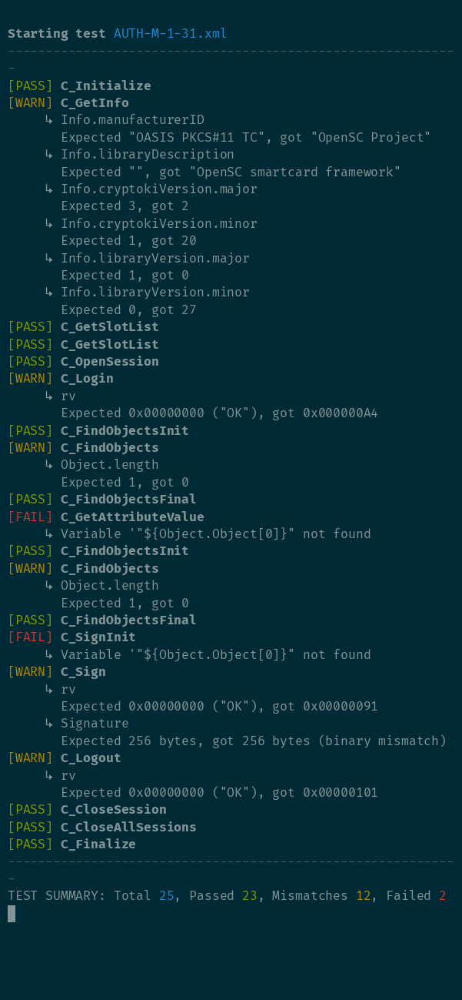

# pkcs11-test [](https://github.com/frankmorgner/pkcs11-test/actions/workflows/release.yml)

## TL;DR: Run PKCS #11 Scripts Without Writing Code

- Runs official PKCS #11 conformance tests defined in XML files from PKCS #11 Profiles 3.1 and 3.2.
- Executes custom XML scripts, making it useful as a scripting layer over PKCS #11 APIs.
- Supports dynamic variables inside XML scripts from outputs for later calls or from environment variables

## Overview

`pkcs11-test` allows running conformance test cases against a PKCS #11 provider.
The test cases were first defined in PKCS #11 version 3.1 and they include an
informal description along with a test case description given in dedicated XML
files.

If no XML input files are specified, this program reads STDIN for PKCS #11 XML commands. All
commands are performed with the given PKCS #11 module in the order in which they appear at
the input.

`pkcs11-test` implements the PKCS #11 XML Representation defined in PKCS #11
Profiles Version [3.1](https://docs.oasis-open.org/pkcs11/pkcs11-profiles/v3.1/pkcs11-profiles-v3.1.html)
and [3.2](https://docs.oasis-open.org/pkcs11/pkcs11-profiles/v3.2/pkcs11-profiles-v3.2.html).
Although the specification was originally designed to define conformance tests
for profile classes of PKCS #11 functionality, `pkcs11-test` can be used for
scripted rather than compiled usage of PKCS #11 modules (see
[examples](#examples) below).

`pkcs11-test` ships with the following test scripts included (both version are supported):
- Baseline Provider ([`BL-M-1-31`](src/test-cases/pkcs11-v3.1/mandatory/BL-M-1-31.xml)/[`BL-M-1-32`](src/test-cases/pkcs11-v3.2/mandatory/BL-M-1-32.xml))
- Extended Provider ([`EXT-M-1-31`](src/test-cases/pkcs11-v3.1/mandatory/EXT-M-1-31.xml)/[`EXT-M-1-32`](src/test-cases/pkcs11-v3.2/mandatory/EXT-M-1-32.xml))
- Authentication Token Provider ([`AUTH-M-1-31`](src/test-cases/pkcs11-v3.1/mandatory/AUTH-M-1-31.xml)/[`AUTH-M-1-32`](src/test-cases/pkcs11-v3.2/mandatory/AUTH-M-1-32.xml))
- Public Certificates Token Provider ([`CERT-M-1-31`](src/test-cases/pkcs11-v3.1/mandatory/CERT-M-1-31.xml)/[`CERT-M-1-32`](src/test-cases/pkcs11-v3.2/mandatory/CERT-M-1-32.xml))

To run `AUTH-M-1-31.xml` against your PKCS #11 module, execute the following command:
```bash
env Pin=123456 pkcs11-test --module /path/to/pkcs11-module.so AUTH-M-1-31.xml
```
The above command passes the token's PIN via the environment variable `$Pin`,
which will be used for `AUTH-M-1-31.xml`. For Windows, the calling convention needs
to be adjusted as follows:
```cmd
set Pin=123456
pkcs11-test.exe --module /path/to/pkcs11-module.dll AUTH-M-1-31.xml
```

Customized test cases can be supplied behind all other arguments. This disables
parsing input from STDIN.

## Examples

### OpenSC's PKCS #11 library and a Yubikey

The following output tested `AUTH-M-1-31.xml` against `opensc-pkcs11.so`:


### SoftHSM

Initialize SoftHSM with a PINs, key pair and add a certificate
([`init.xml`](src/test-cases/pkcs11-v3.1/softhsm-2.6.1/init.xml))
and run the test case for the Authentication Token Provider.
[`AUTH-M-1-31.xml`](src/test-cases/pkcs11-v3.1/softhsm-2.6.1/AUTH-M-1-31.xml)
was adapted to support avoid static test case data, such as
`Info.ManufacturerID` or the `Signature`.
```bash session
$ cat src/test-cases/pkcs11-v3.1/softhsm-2.6.1/init.xml \
    src/test-cases/pkcs11-v3.1/softhsm-2.6.1/AUTH-M-1-31.xml \
    | target/release/pkcs11-test --module libsofthsm2.so

Starting test STDIN test 1
------------------------------------------------------------
[PASS] C_Initialize
[PASS] C_GetSlotList
[PASS] C_InitToken
[PASS] C_OpenSession
[PASS] C_Login
[PASS] C_InitPIN
[PASS] C_Logout
[PASS] C_Login
[PASS] C_GenerateKeyPair
[PASS] C_CreateObject
[PASS] C_CreateObject
[PASS] C_CreateObject
[PASS] C_CreateObject
[PASS] C_CreateObject
[PASS] C_Finalize
------------------------------------------------------------
TEST SUMMARY: Total 15, Passed 15, Mismatches 0, Failed 0

Starting test STDIN test 2
------------------------------------------------------------
[PASS] C_Initialize
[PASS] C_GetInfo
[PASS] C_GetSlotList
[WARN] C_GetSlotList
     ↳ SlotList.length
       Expected 2, got 1
[PASS] C_OpenSession
[PASS] C_Login
[PASS] C_FindObjectsInit
[PASS] C_FindObjects
[PASS] C_FindObjectsFinal
[PASS] C_GetAttributeValue
[PASS] C_FindObjectsInit
[PASS] C_FindObjects
[PASS] C_FindObjectsFinal
[PASS] C_SignInit
[PASS] C_Sign
[PASS] C_Logout
[PASS] C_CloseSession
[PASS] C_CloseAllSessions
[PASS] C_Finalize
------------------------------------------------------------
TEST SUMMARY: Total 19, Passed 19, Mismatches 1, Failed 0
```

## Supports Functions

- [x] `C_GetFunctionList` (all further function calls are performed using the received interface)
- [x] `C_GetInterface` (all further function calls are performed using the received interface)
- [x] `C_Initialize`
- [x] `C_Finalize`
- [x] `C_GetInfo`
- [x] `C_GetSlotList`
- [x] `C_GetSlotInfo`
- [x] `C_GetTokenInfo`
- [x] `C_OpenSession`
- [x] `C_CloseSession`
- [x] `C_CloseAllSessions`
- [x] `C_SessionCancel`
- [x] `C_FindObjectsInit`
- [x] `C_FindObjects`
- [x] `C_FindObjectsFinal`
- [x] `C_CreateObject`
- [x] `C_CopyObject`
- [x] `C_DestroyObject`
- [x] `C_LoginUser`
- [x] `C_Login`
- [x] `C_Logout`
- [x] `C_SignRecoverInit`
- [x] `C_SignRecover`
- [x] `C_SignInit`
- [x] `C_Sign`
- [x] `C_SignUpdate`
- [x] `C_SignFinal`
- [x] `C_MessageSignInit`
- [x] `C_SignMessage`
- [x] `C_EncryptInit`
- [x] `C_Encrypt`
- [x] `C_EncryptUpdate`
- [x] `C_EncryptFinal`
- [x] `C_DecryptInit`
- [x] `C_Decrypt`
- [x] `C_DecryptUpdate`
- [x] `C_DecryptFinal`
- [x] `C_DigestInit`
- [x] `C_Digest`
- [x] `C_DigestUpdate`
- [x] `C_DigestKey`
- [x] `C_DigestFinal`
- [x] `C_GetAttributeValue`
- [x] `C_SetAttributeValue`
- [x] `C_GetMechanismList`
- [x] `C_GetMechanismInfo`
- [x] `C_InitToken`
- [x] `C_InitPIN`
- [x] `C_SetPIN`
- [x] `C_GenerateKeyPair`

## Dynamic Data and User Input

A typical invocation of `C_GetSlotList` to get the number of available slots
may look like this:
```c
CK_BBOOL tokenPresent = CK_FALSE;
CK_ULONG slotListLength;
CK_RV rv = C_GetSlotList(tokenPresent, NULL, &slotListLength);
assert(rv == CKR_OK);
```

The test case equivalent would be the following:
```xml
  <C_GetSlotList>
    <TokenPresent value="true"/>
    <SlotList/>
  </C_GetSlotList>
  <C_GetSlotList rv="OK">
    <SlotList length="${SlotList.length}"/>
  </C_GetSlotList>
```
The test case data implicitly defines an internal variable
`${SlotList.length}`, which stores the result's value until the program
terminates or it is overwritten.

In a second invocation of `C_GetSlotList`, the actual slots can be retrieved:
```c
CK_SLOT_ID_PTR slotList;
CK_RV rv = C_GetSlotList(tokenPresent, &slotList, &slotListLength);
assert(rv == CKR_OK);
```
The test case could look like this:
```xml
  <C_GetSlotList>
    <TokenPresent value="true"/>
    <SlotList length="${SlotList.length}"/>
  </C_GetSlotList>
  <C_GetSlotList rv="OK">
    <SlotList>
      <SlotID value="${SlotList.SlotID[0]}"/>
    </SlotList>
  </C_GetSlotList>
```
Note, that the above the previously stored value in `${SlotList.length}` is now
reused for the second function call. Additionally, the result introduces
`${SlotList.SlotID[0]}` to reference each slot individually in subsequent
function calls.

If some input variable has not been defined explicitly in the test case (i.e.
as output of some function call), then the program's envorinment variables are
searched. This allows the user to input an (otherwise undefined) PIN object to
perform the test:
```xml
  <C_Login>
    <Session value="${Session}"/>
    <UserType value="USER"/>
    <Pin value="${Pin}"/>
  </C_Login>
  <C_Login rv="OK"/>
```
Here, `${Session}` is the output of a call to `C_OpenSession`, whereas `${Pin}`
is read from the program's environment variables, because it was not prevously
defined in the test case.

## Build `pkcs11-test`

```bash
cargo build
```
